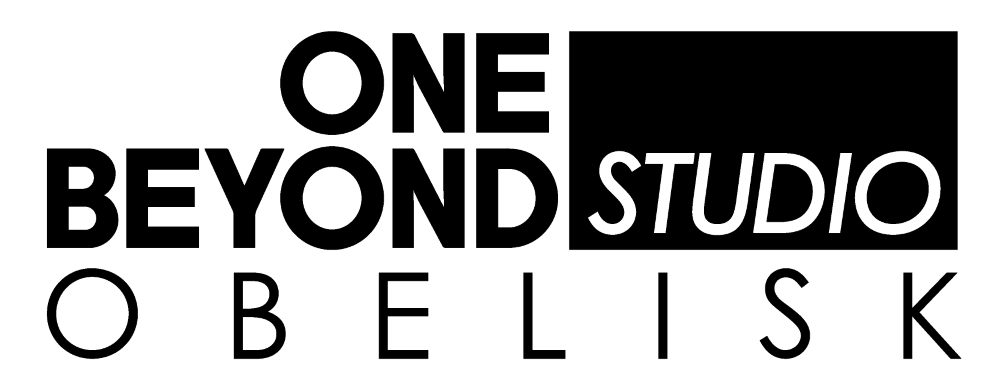

  

# Introduction
On Beyond Studio File Storage is a set of .NET libraries that can be used by developers as a foundation to create their solutions based on Clean Architecture principles.

### Supported .NET version:

7.0

### Installation

`dotnet new install Monaco.Template`

### Documentation

For more detailed documentation, please refer to our [Wiki](https://github.com/onebeyond/onebeyond-studio-file-storage/wiki)

### Contributing

If you want to contribute, we are currently accepting PRs and/or proposals/discussions in the issue tracker.
